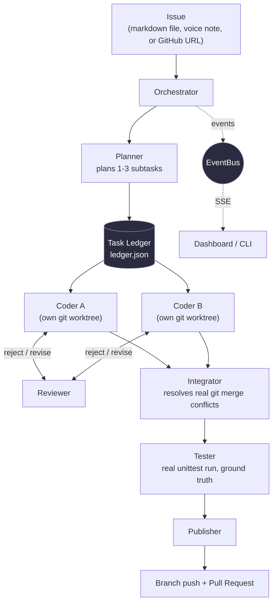

# AgentGrid

**Google DeepMind Bangalore Hackathon, Track: Autonomous Orchestration with Managed Agents (iAPI / Antigravity)**

AgentGrid is a nine-role autonomous coding pipeline. Give it a software issue
and it plans the fix, delegates work through a structured handoff ledger,
codes in parallel git worktrees, argues through real review rejections,
resolves real merge conflicts, survives adversarial test attacks, verifies
UI changes by actually driving a browser, and opens a pull request, with
every handoff visible live on a dashboard.

It runs fully offline with zero third-party dependencies (a deterministic
mock backend that still performs real file writes, git operations, and test
runs), and upgrades to live Gemini function-calling and Google's Managed
Agents / Interactions API the moment an API key is configured.

## Demo video

<a href="https://www.youtube.com/watch?v=k4gK1UIKZLc" target="_blank" rel="noopener noreferrer">
  
</a>

## Table of contents

- [Demo video](#demo-video)
- [Why this exists](#why-this-exists)
- [How it works](#how-it-works)
- [The 9 functionalities](#the-9-functionalities)
- [Architecture](#architecture)
- [Project layout](#project-layout)
- [Getting started](#getting-started)
- [Running against a real GitHub issue](#running-against-a-real-github-issue)
- [Configuration](#configuration)
- [Dependency tiers](#dependency-tiers)
- [Demo target: SplitSathi](#demo-target-splitsathi)
- [Testing](#testing)
- [Design decisions](#design-decisions)
- [Known limitations](#known-limitations)

## Why this exists

Most "AI coding agent" demos are a single model in a loop with a shell.
AgentGrid instead models a small software team: a planner that breaks work
into subtasks, coders that work in isolated branches, a reviewer that can
reject and force a rewrite, an integrator that resolves the merge conflicts
that naturally show up when two coders touch the same file, a tester that is
plain deterministic code (not another model's opinion), and a publisher that
opens the pull request. Every handoff between roles is a structured record,
not a chat message, so context never silently gets lost between steps.

## How it works

1. **Planner** reads the issue and produces 1-3 subtasks with acceptance
   criteria.
2. **Coders** implement each subtask in its own git worktree, in parallel.
3. **Reviewer** checks each coder's diff against the acceptance criteria and
   can reject it, sending the coder back with concrete feedback.
4. **Integrator** merges every worktree back into one branch, resolving real
   `git merge` conflicts when two coders touched the same file.
5. **Tester** runs the real test suite. This is the ground truth: no model
   sits between the suite and pass/fail.
6. **Publisher** pushes the branch and opens a PR (a real GitHub PR via the
   `gh` CLI if configured, otherwise a local branch push and a written PR
   preview).

Three other roles cover the remaining modes: **Breaker** (adversarial mode,
writes failing tests until the Coder's fix satisfies them), **Verifier**
(visual mode, checks a UI change against a mockup, optionally by driving a
real browser), and **Intake** (voice mode, turns a spoken issue report,
including Hinglish, into a structured issue).

## The 9 functionalities

| # | Functionality | Where |
|---|----------------|-------|
| 1 | Core issue-to-patch loop (Planner, Coder, Tester) | `agentgrid/pipeline/orchestrator.py` |
| 2 | Structured handoff ledger (tasks, packets, no lost context) | `agentgrid/ledger.py` |
| 3 | Reviewer-Coder critique loop (real rejections, bounded rounds) | `_implement_subtask` in `orchestrator.py` |
| 4 | Parallel coder fan-out in git worktrees, Integrator resolving real merge conflicts | `_run_standard` + `agentgrid/tools/gitops.py` |
| 5 | Live dashboard (server-sent events, agent graph, feed, ledger board, no external JS) | `agentgrid/server/` |
| 6 | PR finale (real GitHub PR via `gh` CLI when available, local push and preview always) | `agentgrid/tools/github.py` |
| 7 | Breaker/Fixer adversarial TDD (failing spec tests until concession) | `_run_adversarial` in `orchestrator.py` |
| 8 | Screenshot-to-feature with an interactive Computer Use Verifier: drives a real browser (click, scroll, type) via Gemini's `computer_use` tool instead of judging a static screenshot; falls back to vision-on-screenshot or HTML inspection if unavailable | `_run_visual`, `agentgrid/llm/computer_use.py`, `agentgrid/tools/computer_use.py` |
| 9 | Voice issue intake (spoken report, including Hinglish, to structured issue) and legacy code modernization | `_run_voice` in `orchestrator.py` |
| bonus | Live GitHub issue resolution: fork a real repo, pull a real issue by URL, run the full pipeline against it, and open a real PR | `run_issue` in `orchestrator.py` |

## Architecture



**Swappable LLM backends** sit behind one interface (`agentgrid/llm/base.py`)
and every role above is dispatched through whichever is active:

| Backend | What it does |
|---------|--------------|
| `mock` | deterministic scripted fixtures; every tool (files, git, tests) still executes for real |
| `gemini` | Gemini function-calling for every role |
| `managed` | Google Managed Agents (Interactions API) for the pure-reasoning roles (Planner, Reviewer, Verifier, Intake, Publisher), plus Gemini function-calling for roles that must edit local files (Coder, Integrator, Breaker) — this hybrid split is the architecture story |
| `auto` | picks the managed+gemini hybrid if a key is present, otherwise falls back to `mock` |

Key properties:

- **Handoffs carry structured context, not chat history.** Each role passes
  the next role a task, its acceptance criteria, and any prior critique
  through the ledger, not a raw transcript. Every handoff is recorded and
  streamed live to the dashboard.
- **Tests are the ground truth.** The Tester role runs real `unittest`
  against real files; no model interprets or overrides a test result.
- **File access is sandboxed.** Every agent's file tools are jailed to its
  own git worktree (`agentgrid/tools/fs.py` rejects path escapes), and tool
  failures return an error to the model instead of crashing the run.
- **The mock backend only mocks the intelligence.** File writes, git
  worktrees, merges, conflicts, and test runs are all real even with no API
  key configured, so the offline smoke suite exercises the true pipeline,
  not a simulation of it.

## Project layout

```
agentgrid/
  agents/
    base.py            agent tool-calling loop (Agent.run)
    roster.py           the 9 role definitions and system prompts
  llm/
    base.py              shared LLMBackend / ToolCall interface
    mock.py               deterministic offline backend
    gemini.py             Gemini function-calling backend
    managed.py             Google Managed Agents (Interactions API) backend
    computer_use.py         interactive Computer Use verify loop
  pipeline/
    orchestrator.py     drives all 5 run modes (standard, adversarial,
                         visual, voice, live-GitHub-issue)
  tools/
    fs.py                sandboxed read/write/list file tools
    gitops.py             worktrees, merges, conflict handling
    github.py              gh CLI integration, PR publishing
    computer_use.py         Playwright execution arm for Computer Use
    testrunner.py           real unittest execution
    screenshot.py           static screenshot capture fallback
  server/
    app.py               stdlib HTTP + SSE dashboard server
    static/index.html      dashboard UI (no CDN dependencies)
  ledger.py              structured task/handoff ledger
  bus.py                  in-process event bus (feeds dashboard + CLI)
  assets.py                generates demo mockup PNG / voice-note WAV
  cli.py                   `agentgrid` command-line entry point
  smoke.py                offline end-to-end smoke test of all 4 pipelines
demo/
  target_template/       the SplitSathi demo repo (source + planted issues)
  fixtures/                scripted responses for the mock backend
tests/                    unit and end-to-end test suite
```

## Getting started

Requires Python 3.9+ and git. No API key or pip installs are needed for the
first three commands:

```bash
python3 -m agentgrid smoke          # all 4 pipelines end-to-end, offline
python3 -m agentgrid serve          # live dashboard at http://127.0.0.1:8765
python3 -m agentgrid run --issue ISSUE-1   # run one issue in the terminal
python3 -m unittest discover -s tests -t . # unit + e2e suite
```

### Going live

Real Gemini function-calling only needs Python 3.9+:

```bash
python3 -m venv .venv && source .venv/bin/activate
cp .env.example .env                # then paste in GEMINI_API_KEY=...
pip install google-genai
python3 -m agentgrid doctor --probe # verifies key, SDK, model ids, live round-trip
python3 -m agentgrid run --issue ISSUE-1 --backend gemini
```

The real Managed Agents surface (`client.agents` / `client.interactions`)
additionally needs **Python 3.10+**. `google-genai` dropped Python 3.9
support after version 1.47.0, and on 3.9 `pip install google-genai` silently
resolves to that older, surface-less release with no error:

```bash
python3.10 -m venv .venv && source .venv/bin/activate
pip install google-genai
python3 -m agentgrid run --issue ISSUE-1 --backend auto
```

`agentgrid doctor` lists exactly which model IDs your key can reach and
flags which surfaces are available. `--backend managed` / `auto` use the
real Managed Agents path when Python 3.10+ and `google-genai` 2.x are both
present; otherwise they fall back automatically to `gemini`
(pure function-calling), so the pipeline never breaks, it just loses the
Managed Agents story on older Python.

Optional extras:

```bash
pip install playwright && playwright install chromium   # real browser-driven Verifier
brew install gh && gh auth login                        # real GitHub PRs
```

Without these, nothing breaks: the Verifier falls back to HTML-source
inspection, and the Publisher pushes to a local bare origin and writes
`runs/<run-id>/pr_preview.md` instead of opening a real PR.

## Running against a real GitHub issue

Pass a GitHub issue URL instead of a demo issue ID:

```bash
python3 -m agentgrid run --issue https://github.com/<owner>/<repo>/issues/<number> --backend auto
```

AgentGrid forks the repository into your authenticated `gh` account, does a
shallow clone of the fork, pulls the real issue title and body, runs the
full pipeline against it, and opens a real pull request back to the
original repository when done. This needs the `gh` CLI authenticated
(`gh auth login`) and does not require the target repo to be one you own.

## Configuration

All configuration lives in `.env` (copy from `.env.example`):

| Variable | Purpose |
|----------|---------|
| `GEMINI_API_KEY` | enables all live backends; empty means mock-only |
| `AGENTGRID_MODEL` | Gemini model ID, e.g. `gemini-3.5-flash` |
| `AGENTGRID_BASE_AGENT` | base Managed Agent id |
| `AGENTGRID_BACKEND` | `auto` \| `mock` \| `gemini` \| `managed` |
| `GITHUB_REPO` | `owner/repo` for the demo-issue PR flow; not needed for the live-issue-URL flow above |
| `AGENTGRID_CU_DISABLE` | set to `1` to skip the Computer Use Verifier and always use the faster static-screenshot path |
| `AGENTGRID_CU_HEADED` | set to `1` to watch Computer Use drive a real, visible Chromium window instead of running headless |
| `AGENTGRID_MOCK_DELAY` | artificial per-turn delay for the mock backend, for demo pacing |
| `AGENTGRID_PORT` | dashboard port (default 8765) |

## Dependency tiers

| Tier | Requires | Enables |
|------|----------|---------|
| 0 | Python 3.9+, git | smoke test, mock runs, dashboard, unit tests, nothing to `pip install` |
| 1 | Python 3.9+, `pip install google-genai`, `GEMINI_API_KEY` | real Gemini function-calling (`--backend gemini`) |
| 1.5 | Python 3.10+ venv, `pip install google-genai` | real Managed Agents (`--backend managed` / `auto`); on 3.9 the same install silently resolves to a version without this surface |
| 2 | `pip install playwright && playwright install chromium` | the Computer Use Verifier's execution arm and static screenshots; without it, visual mode falls back to vision-on-HTML-source |
| 3 | `gh` CLI authenticated | real GitHub PRs, forking, and the live-issue-URL flow |

## Demo target: SplitSathi

`demo/target_template` is a small UPI-flavored expense-splitting library
used as the pipeline's target repository, with four planted issues that
exercise every mode:

- an engineered collision between a paisa-rounding fix and a
  settlement-summary feature in the same file, producing a real merge
  conflict for the Integrator
- a paise-conservation leak for the Breaker to attack and the Coder to fix
- a stats-page UI mockup for the Verifier to check against the live page
- a legacy, undocumented module reported by voice note (Hinglish supported)
  for the Intake role to structure and the Coder to modernize

`python3 -m agentgrid setup-demo` seeds a local bare git origin under
`runs/`. Every run clones fresh from it, so the demo resets for free.

## Testing

```bash
python3 -m unittest discover -s tests -t .
```

13 tests covering the ledger, tool sandboxing, git operations, and full
end-to-end runs of all 4 pipeline modes against the mock backend.

## Design decisions

- **Structured handoffs over chat transcripts.** Passing typed packets
  (task, acceptance criteria, prior critique) through the ledger, instead of
  letting agents share raw conversation history, keeps context from being
  lost or diluted across a long run and makes every handoff independently
  inspectable.
- **Deterministic ground truth for pass/fail.** The Tester is plain code
  running the real test suite, never a model judging its own or another
  model's work.
- **Fail open, not closed.** Every optional capability (Managed Agents,
  Computer Use, real GitHub PRs, real screenshots) is feature-detected at
  runtime and falls back to a working alternative rather than crashing the
  run.
- **Sandboxed by construction.** Coders and the Integrator each work inside
  their own git worktree with path-escape checks on every file tool, so a
  bad model response can't write outside the run's own directory.

## Known limitations

- The demo voice note (`ISSUE-4.wav`) is a synthesized placeholder tone, not
  a real recording; the Intake role's transcription only reflects genuine
  audio content when a real recording is substituted for it.
- The live-GitHub-issue flow force-pushes to your fork; it does not touch
  the original repository's branches directly, but review the diff before
  merging any PR it opens.
- Visual-mode verification without Playwright installed falls back to
  reading rendered HTML source rather than an actual screenshot comparison.
